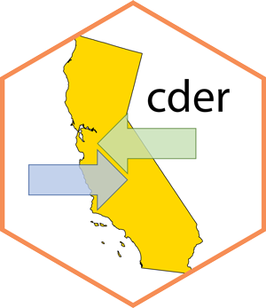

# cder: Interface to CDEC 

This package provides an R interface to the 
[California Data Exchange Center](https://cdec.water.ca.gov/)
(CDEC) [Web API](https://cdec.water.ca.gov/dynamicapp/wsSensorData). 

